---

## Table of Contents

- [Introduction](#introduction)
- [The Challenge: ERP Meets Mobile](#the-challenge-erp-meets-mobile)
- [Architectural Foundations](#architectural-foundations)
- [Scalability Patterns](#scalability-patterns)
- [Performance Optimization](#performance-optimization)
- [State Management at Scale](#state-management-at-scale)
- [Data Synchronization Strategy](#data-synchronization-strategy)
- [Security & Compliance](#security--compliance)
- [Lessons Learned](#lessons-learned)
- [Conclusion](#conclusion)

---

## Introduction

Building a mobile application is one thing. Building a mobile application that serves as a critical touchpoint for an enterprise ERP system is another challenge entirely. Over the past [X months/years], I've been leading the development of a Flutter mobile application that integrates seamlessly with our ERP SaaS platform, serving [X number] of active users across [X companies/departments].

This post shares the architectural decisions, scalability patterns, and hard-won lessons from building a production-ready Flutter app in the enterprise space.

### What We're Building

- **Product**: Mobile companion app for an ERP SaaS platform
- **Key Modules**: CRM, Time & Expense tracking, [other modules]
- **Scale**: [X] daily active users, [X] API calls per day
- **Tech Stack**: Flutter, [backend tech], [state management solution]

---

## The Challenge: ERP Meets Mobile

### Why ERP Mobile Apps Are Different

Unlike consumer apps, ERP mobile applications face unique challenges:

**Complex Data Relationships**

- ERP systems manage intricate relationships between entities (customers, orders, invoices, inventory)
- Mobile apps must maintain data consistency across these relationships
- Users expect desktop-level functionality in a mobile form factor

**Enterprise Requirements**

- Role-based access control (RBAC) with granular permissions
- Audit trails and compliance requirements
- Multi-tenant architecture with data isolation
- Offline capability for field workers

**Performance Constraints**

- Large datasets that can't be fully loaded on mobile devices
- Real-time synchronization with backend systems
- Battery and bandwidth efficiency
- Support for older devices in enterprise environments

### Initial Requirements

When we started this project, our key requirements were:

1. **Seamless integration** with existing ERP backend
2. **Offline-first capability** for users in areas with poor connectivity
3. **Sub-3-second load times** for critical workflows
4. **Support for [X]+ concurrent users** without performance degradation
5. **Maintainable codebase** for long-term evolution

---

## Architectural Foundations

### High-Level Architecture

```mermaid
graph TB
    subgraph Flutter["Flutter Mobile App"]
        Presentation["Presentation Layer<br/>(UI/Widgets)<br/>├── Screens<br/>├── Widgets<br/>└── Theme/Styling"]
        Business["Business Logic Layer<br/>├── State Management<br/>├── View Models<br/>└── Business Rules"]
        Domain["Domain Layer<br/>├── Entities<br/>├── Use Cases<br/>└── Repository Interfaces"]
        Data["Data Layer<br/>├── Repository Implementations<br/>├── Data Sources (Remote/Local)<br/>├── Local Database (SQLite/Hive/Isar)<br/>└── API Client"]

        Presentation --> Business
        Business --> Domain
        Domain --> Data
    end

    subgraph Backend["ERP Backend Services"]
        API["REST/GraphQL APIs"]
        Auth["Authentication Service"]
        BL["Business Logic Services"]
        DB["Database"]
    end

    Data --> API
    Data --> Auth

    style Flutter fill:#e3f2fd
    style Backend fill:#fff3e0
```



### Architectural Principles

**1. Clean Architecture / Layered Architecture**

We adopted a clean architecture approach to ensure:

- **Separation of concerns**: UI, business logic, and data layers are independent
- **Testability**: Each layer can be tested in isolation
- **Flexibility**: Easy to swap implementations (e.g., changing state management)

**2. Repository Pattern**

The repository pattern serves as an abstraction layer between business logic and data sources:

```dart
// Example: Repository interface
abstract class CustomerRepository {
  Future<List<Customer>> getCustomers({int page, int limit});
  Future<Customer> getCustomerById(String id);
  Future<void> syncCustomers();
  Stream<List<Customer>> watchCustomers();
}

// Implementation handles both remote and local data
class CustomerRepositoryImpl implements CustomerRepository {
  final RemoteDataSource _remoteDataSource;
  final LocalDataSource _localDataSource;

  // Implementation details...
}
```

**Benefits:**

- Single source of truth for data access
- Easier to implement caching and offline support
- Simplifies testing with mock repositories

**3. Dependency Injection**

We use [get_it/injectable/riverpod] for dependency injection:

- Promotes loose coupling
- Makes testing straightforward
- Improves code organization

---

## Scalability Patterns

### 1. Pagination & Lazy Loading

**Challenge:** Loading thousands of records (customers, transactions) crashes the app or causes poor performance.

**Solution:** Implement pagination at both API and UI levels

```dart
// Example: Infinite scroll with pagination
class CustomerListViewModel extends ChangeNotifier {
  final CustomerRepository _repository;
  List<Customer> _customers = [];
  int _currentPage = 1;
  bool _hasMore = true;

  Future<void> loadMore() async {
    if (!_hasMore) return;

    final newCustomers = await _repository.getCustomers(
      page: _currentPage,
      limit: 20,
    );

    if (newCustomers.length < 20) {
      _hasMore = false;
    }

    _customers.addAll(newCustomers);
    _currentPage++;
    notifyListeners();
  }
}
```

**Results:**

- Reduced initial load time from [X]s to [Y]s
- Memory usage decreased by [X]%
- Smooth scrolling even with [X]+ records

### 2. Data Caching Strategy

**Multi-level caching approach:**


**Implementation:**

- **In-memory cache**: For frequently accessed, rarely changed data (e.g., dropdown values)
- **Persistent cache**: SQLite/Hive for offline support
- **Cache invalidation**: Time-based + event-based strategies

**Results:**

- [X]% reduction in API calls
- App remains functional with [X]% offline capability

### 3. Smart Sync Mechanisms

**Challenge:** Syncing large datasets without blocking the UI or draining battery

**Solution:** Background sync with differential updates

```dart
class SyncService {
  Future<void> performSync() async {
    // 1. Get last sync timestamp
    final lastSync = await _getLastSyncTime();

    // 2. Fetch only changed records since last sync
    final updates = await _api.getUpdates(since: lastSync);

    // 3. Apply updates to local database
    await _localDb.applyUpdates(updates);

    // 4. Update sync timestamp
    await _setLastSyncTime(DateTime.now());
  }
}
```

**Optimizations:**

- Sync only delta changes, not full datasets
- Batch operations to reduce database writes
- Use background isolates for heavy processing
- Implement exponential backoff for failed syncs

### 4. Modular Architecture

**Feature-based modules** for better scalability:

```
lib/
├── features/
│   ├── crm/
│   │   ├── data/
│   │   ├── domain/
│   │   └── presentation/
│   ├── time_expense/
│   │   ├── data/
│   │   ├── domain/
│   │   └── presentation/
│   └── shared/
├── core/
│   ├── network/
│   ├── database/
│   └── utils/
└── main.dart
```

**Benefits:**

- Teams can work on features independently
- Easier to understand and navigate codebase
- Potential to extract features as packages

---

## Performance Optimization

### Key Metrics & Targets

| Metric                | Target  | Current |
| --------------------- | ------- | ------- |
| App startup time      | < 2s    | [X]s    |
| Time to interactive   | < 3s    | [X]s    |
| API response handling | < 500ms | [X]ms   |
| Frame rate            | 60 FPS  | [X] FPS |
| Memory footprint      | < 150MB | [X]MB   |

### Optimization Strategies

**1. Widget Optimization**

```dart
// Bad: Rebuilds entire list on every change
ListView.builder(
  itemBuilder: (context, index) {
    return CustomerCard(customer: customers[index]);
  },
)

// Good: Only rebuilds changed items
ListView.builder(
  itemBuilder: (context, index) {
    return CustomerCard(
      key: ValueKey(customers[index].id),
      customer: customers[index],
    );
  },
)
```

**2. Image Optimization**

- Lazy loading with `cached_network_image`
- Image compression before upload
- Thumbnail generation for lists
- Progressive loading for large images

**3. Code Splitting & Lazy Loading**

```dart
// Lazy load heavy features
final TimeExpenseScreen = () => import('./features/time_expense/screen.dart');

// Load only when needed
Navigator.push(
  context,
  MaterialPageRoute(builder: (_) => TimeExpenseScreen()),
);
```

**4. Database Optimization**

- Indexed frequently queried fields
- Batch inserts/updates
- Use transactions for multiple operations
- Regular database cleanup

**Results:**

- App startup improved by [X]%
- Reduced jank/frame drops by [X]%
- [X]% reduction in memory usage

---

## State Management at Scale

### Choosing the Right Solution

We evaluated several state management solutions:

| Solution | Pros                 | Cons                   | Our Use Case     |
| -------- | -------------------- | ---------------------- | ---------------- |
| Provider | Simple, built-in     | Can get messy at scale | ❌               |
| BLoC     | Structured, testable | Boilerplate-heavy      | ✅ Complex flows |
| Riverpod | Modern, flexible     | Learning curve         | ✅ General use   |
| GetX     | Fast, minimal code   | Magic, less control    | ❌               |

**Our Approach:** Hybrid strategy

- **Riverpod** for general state management
- **BLoC** for complex business logic flows (e.g., multi-step forms)
- **Local state** (StatefulWidget) for simple UI state

### State Management Architecture

```dart
// Example: Riverpod providers for ERP module

// Repository provider
final customerRepositoryProvider = Provider<CustomerRepository>((ref) {
  return CustomerRepositoryImpl(
    remoteDataSource: ref.read(apiClientProvider),
    localDataSource: ref.read(databaseProvider),
  );
});

// State notifier for customer list
final customerListProvider = StateNotifierProvider<CustomerListNotifier, AsyncValue<List<Customer>>>((ref) {
  return CustomerListNotifier(
    repository: ref.read(customerRepositoryProvider),
  );
});

// In UI
class CustomerListScreen extends ConsumerWidget {
  @override
  Widget build(BuildContext context, WidgetRef ref) {
    final customersAsync = ref.watch(customerListProvider);

    return customersAsync.when(
      data: (customers) => ListView.builder(...),
      loading: () => CircularProgressIndicator(),
      error: (error, stack) => ErrorWidget(error),
    );
  }
}
```

### Handling Complex State

**Challenge:** Managing interdependent states (e.g., filters, sorting, pagination)

**Solution:** Composite state objects

```dart
@freezed
class CustomerListState with _$CustomerListState {
  const factory CustomerListState({
    @Default([]) List<Customer> customers,
    @Default(CustomerFilter.all()) CustomerFilter filter,
    @Default(CustomerSort.name) CustomerSort sort,
    @Default(1) int currentPage,
    @Default(false) bool isLoading,
    @Default(true) bool hasMore,
  }) = _CustomerListState;
}
```

---

## Data Synchronization Strategy

### Offline-First Approach

**Philosophy:** The app should work offline by default, syncing when connectivity is available.

### Sync Architecture


### Conflict Resolution

**Challenge:** Handling conflicts when offline changes clash with server updates

**Our Strategy:**

1. **Last-write-wins** for simple fields
2. **Server-wins** for critical financial data
3. **Manual resolution** for complex conflicts (flag for user review)

```dart
class ConflictResolver {
  Future<ResolvedData> resolve(LocalData local, RemoteData remote) async {
    if (local.timestamp > remote.timestamp) {
      // Check conflict rules
      if (isCriticalField(local.field)) {
        return remote; // Server wins for critical data
      }
      return local; // Local wins
    }
    return remote;
  }
}
```

### Sync Indicators & UX

**User feedback is critical:**

- Sync status indicator in app bar
- Last sync timestamp display
- Retry options for failed syncs
- Clear indication of offline mode

---

## Security & Compliance

### Enterprise Security Requirements

**1. Authentication & Authorization**

- JWT-based authentication
- Refresh token rotation
- Biometric authentication support
- Automatic session timeout

**2. Data Encryption**

- Encryption at rest (SQLCipher for local database)
- TLS 1.3 for data in transit
- Secure storage for sensitive data (flutter_secure_storage)

**3. Role-Based Access Control**

```dart
class PermissionService {
  bool canAccess(User user, Feature feature) {
    return user.permissions.contains(feature.requiredPermission);
  }
}

// In UI
if (permissionService.canAccess(currentUser, Feature.deleteCustomer)) {
  // Show delete button
}
```

**4. Audit Logging**

- Track all data modifications
- Log authentication events
- Sync audit trails with backend

### Compliance Considerations

- **GDPR**: Right to deletion, data export
- **SOC 2**: Audit trails, access controls
- **Industry-specific**: [Any relevant compliance requirements]

---

## Lessons Learned

### What Worked Well ✅

**1. Starting with Clean Architecture**

- Made refactoring painless as requirements evolved
- New team members onboarded quickly
- Test coverage reached [X]% because of good separation

**2. Offline-First from Day One**

- Avoided major architectural rewrites later
- Users love the offline capability
- Reduced server costs by [X]% due to less API calls

**3. Investing in Developer Experience**

- Code generation (freezed, json_serializable) saved countless hours
- Comprehensive linting rules caught bugs early
- CI/CD pipeline gave confidence in releases

**4. Leveraging AI Coding Assistants**

- GitHub Copilot accelerated boilerplate code generation
- Freed up time to focus on architectural decisions
- Improved code consistency across the team

### What We'd Do Differently 🔄

**1. Earlier Investment in Performance Monitoring**

- Should have added Firebase Performance Monitoring from the start
- Would have caught performance regressions sooner

**2. More Aggressive Code Splitting**

- Initial bundle size grew faster than expected
- Feature flags would have helped manage complexity

**3. Better API Contract Testing**

- Breaking API changes caused mobile app issues
- Should have implemented contract tests earlier

**4. Documentation from the Start**

- Architecture decisions were made but not always documented
- New team members struggled to understand "why" decisions were made

### Key Takeaways 💡

1. **Architecture matters more at scale** - The time invested in clean architecture pays exponential dividends
2. **Performance is a feature** - Users judge enterprise apps by speed and reliability
3. **Offline support is non-negotiable** - Enterprise users work in varied conditions
4. **Security cannot be an afterthought** - Build it in from the foundation
5. **Developer productivity compounds** - Good tooling and architecture make teams faster over time

---

## Conclusion

Building a scalable Flutter application for ERP systems requires thinking beyond typical mobile app patterns. The combination of complex data relationships, offline requirements, and enterprise security demands a robust architectural foundation.

### Key Success Factors

- **Clean, layered architecture** that separates concerns
- **Offline-first approach** with smart synchronization
- **Performance optimization** from the start
- **Modular design** for team scalability
- **Security baked in**, not bolted on

### Looking Forward

As we continue to evolve this application, we're focusing on:

- Micro-frontend architecture for even better modularity
- Enhanced AI-powered features (search, recommendations)
- Real-time collaboration features
- Expanded offline capabilities

---

## Resources & Further Reading

**Flutter Architecture:**

- [Clean Architecture in Flutter](https://example.com)
- [State Management Comparison](https://example.com)

**Performance:**

- [Flutter Performance Best Practices](https://flutter.dev/docs/perf)
- [Optimizing Flutter Apps](https://example.com)

**ERP Integration:**

- [Building Enterprise Mobile Apps](https://example.com)
- [Offline-First Architecture](https://example.com)

---

## Let's Connect

I'd love to hear about your experiences building Flutter apps for enterprise systems. What challenges have you faced? What patterns have worked for you?

Feel free to reach out:

- **LinkedIn:** [Your LinkedIn URL]
- **GitHub:** [Your GitHub URL]
- **Email:** [Your Email]

---

_Have questions about Flutter architecture, ERP integration, or AI-assisted development? Drop a comment below or connect with me on LinkedIn!_

---

## About the Author

[Your name] is a software engineer specializing in Flutter mobile development and enterprise applications. Currently leading mobile development for an ERP SaaS platform, [he/she/they] focuses on scalable architecture, performance optimization, and AI-first development practices.

---

**Tags:** #Flutter #MobileDevelopment #ERP #SoftwareArchitecture #CleanArchitecture #EnterpriseApps #iOSDevelopment #AndroidDevelopment #TechLeadership
